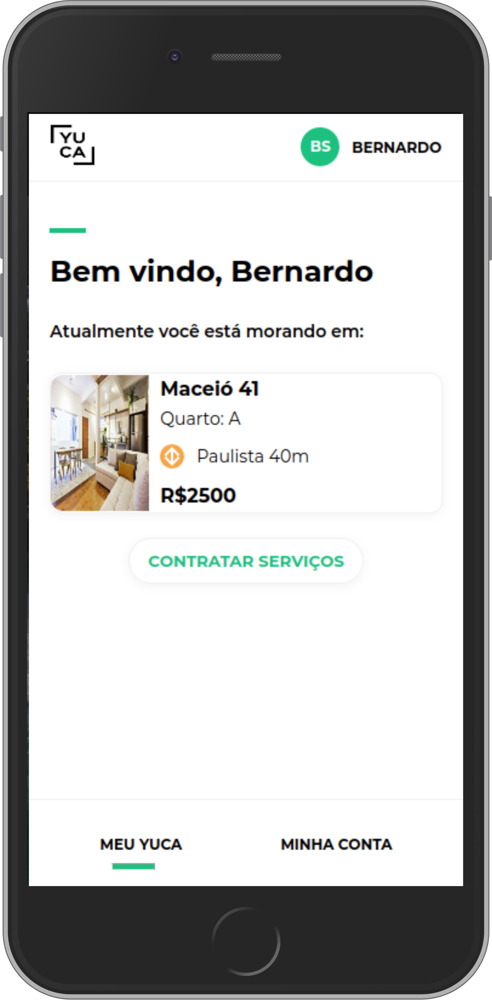

#  Yuca 2.0

   

 

   
   

---

## :rocket: Deployed application:

### https://yuca.vercel.app/

##  Design & Assessment

[Design on Figma](https://www.figma.com/file/ofetdcZKc2BTuWHkAXJOBv/Teste-Front-End?node-id=0%3A1)\
[Assessment](https://github.com/yuca-live/front-end-assessment)

## :dart: Required Features:

### If you want to see the images bigger, click on them. But i strongly suggest to check out the live version by clicking [here](https://yuca.vercel.app/)

### Desktop Version

#### Home page

## :chart_with_upwards_trend: Extra Features:

## :movie_camera: Application Tour:
