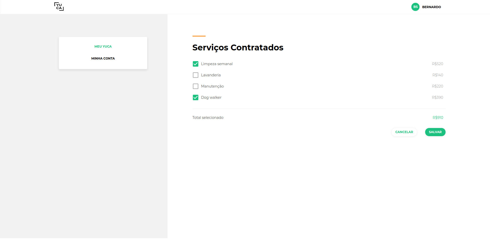
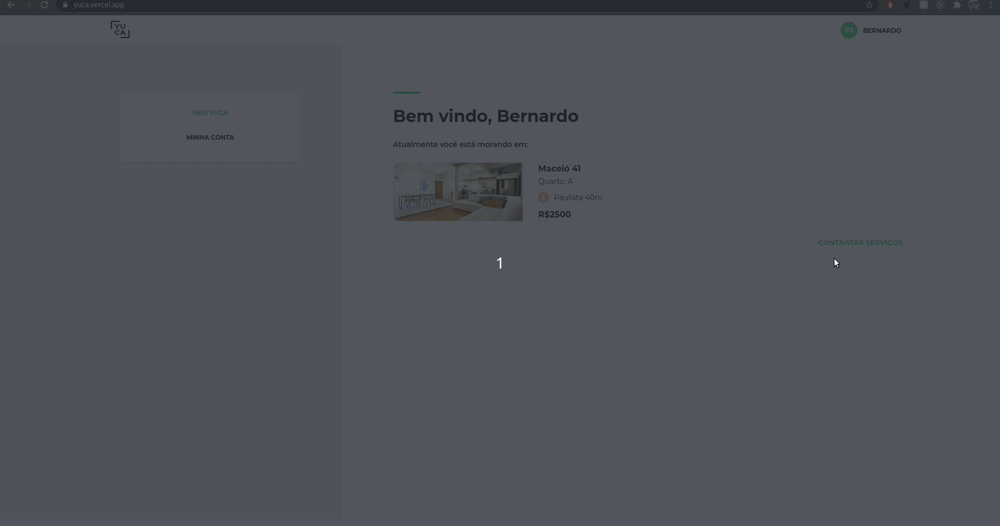
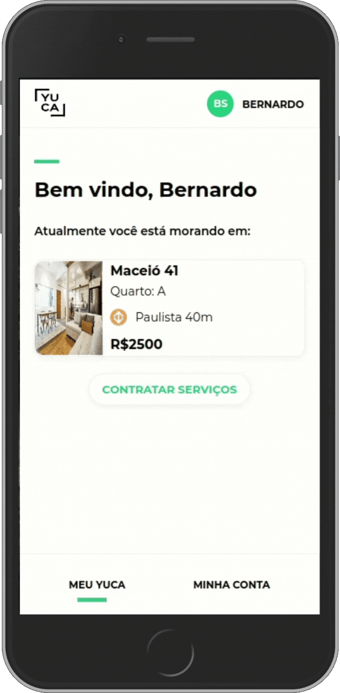
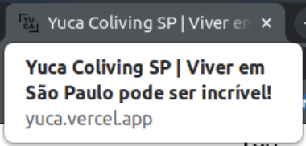
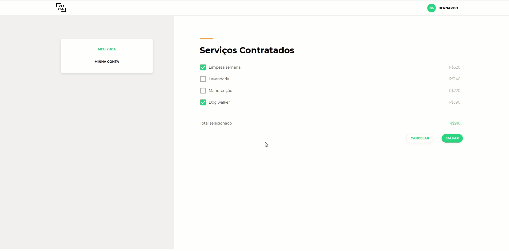
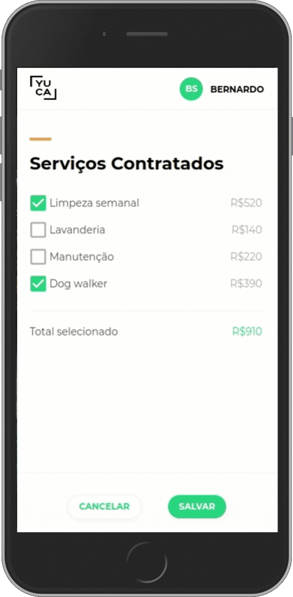

# [ Yuca 2.0](https://yuca.vercel.app/)

   

 

   
   

---

## :rocket: Deployed application:

### https://yuca.vercel.app/

## :pushpin: Table of Contents

- [Deployed application](#rocket-deployed-application)
- [Design & Assessment](#art-design-&-assessment)
- [Required Features](#dart-required-features)
  - [Desktop Version](#computer-desktop-version)
  - [Mobile Version](#iphone-mobile-version)
- [Extra Features](#chart_with_upwards_trend-extra-features)
  - [Persist Hire Services Session Storage](#one-persist-hire-services-session-storage)
  - [My Account](#two-my-account)
  - [Change Account Informations](#three-change-account-informations)
  - [Success](#four-success)
  - [Page Not Found](#five-page-not-found)
  - [Favicon & Page Title](#six-favicon-&-page-title)
  - [Toast Message](#seven-toast-message-for-success-operation)
  - [Unit Tests](#eight-unit-tests)
  - [Application deployed using Vercel](#six-application-deployed-using-vercel)
- [Application Tour](#movie_camera-application-tour)

## :art: Design & Assessment

- [Design on Figma](https://www.figma.com/file/ofetdcZKc2BTuWHkAXJOBv/Teste-Front-End?node-id=0%3A1)
- [Assessment](https://github.com/yuca-live/front-end-assessment)

## :dart: Required Features:

### :exclamation: If you want to see the images bigger, click on them. But i strongly suggest to check out the live version by clicking [here](https://yuca.vercel.app/).

### :computer: Desktop Version

#### Home

   

#### Hire Services

   

### :iphone: Mobile Version

#### Home & Hire Services

   
   

## :chart_with_upwards_trend: Extra Features:

### :one: Persist Hire Services Session Storage

   
   

### :two: My Account

   
   

### :three: Change Account Informations

   
   

### :four: Success

   
   

### :five: Page Not Found

   
   

### :six: Favicon & Page Title

   

### :seven: Toast Message for Success Operation (Alternative for Success Page)

   
   

### :eight: Unit Tests

#### [Click here to see the code from Home and Hire Services components](https://github.com/gabrielvrl/yuca/tree/gv-v2.0/src/__tests__)

#### [If you want App.js test, click here](https://github.com/gabrielvrl/yuca/blob/gv-v2.0/src/App.test.js)

   

### :eight: Application deployed using Vercel

#### https://yuca.vercel.app/

## :movie_camera: Application Tour:

### Desktop Version

#### By [clicking here](https://youtu.be/hdinE654Os8) you will be directed to the Desktop Version Video on Youtube

### Mobile Version

#### By [clicking here](https://youtu.be/YrO1dx1zea4) you will be directed to the Mobile Version Video on Youtube
